# Inventory Management System

_"Simple Inventory Management System powered by Flask"_

## Table of Contents

- [Installation](#installation)
- [Overview](#overview)
- [Usage](#usage)
  - [Starting Things Up](#starting-things-up)
  - [Getting Into It](#getting-into-it)
    - [Inserting products and locations](#adding-products-and-locations)
    - [Moving things around](#moving-things-around)
    - [Editing Existing Data](#editing-existing-information)
- [Dependencies](requirements.txt)
- [License](#license)

## Installation

git repository:

```sourceCode console
$ cd Inventory_Management_System
```

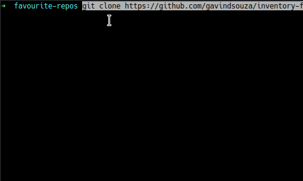

Install necessary dependencies

```sourceCode console
$ pip3 install -r requirements.txt
```

Which is the same as

```sourceCode console
$ pip3 install flask
```

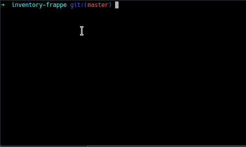

## Overview

The index page or summary covers the system summary, containing lists of products and locations along with a count of unallocated products.
On the _products page_, we can add/edit/remove products from the system. The _location page_ covers similar functionality in the context of locations or warehouses.
The logistics page allows for product movement and maintains a tabular history of all transactions.

## Usage

### Starting Things up

To run the application, change the current working directory to
\~/Inventory_Management_System/inventory/

```sourceCode console
$ cd inventory
```

run the app by typing the following command into your terminal

```sourceCode console
$ python3 -m flask run
```

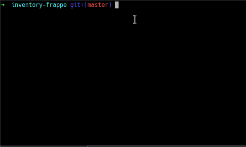

The application can be accessed at _localhost:5000_ in your browser

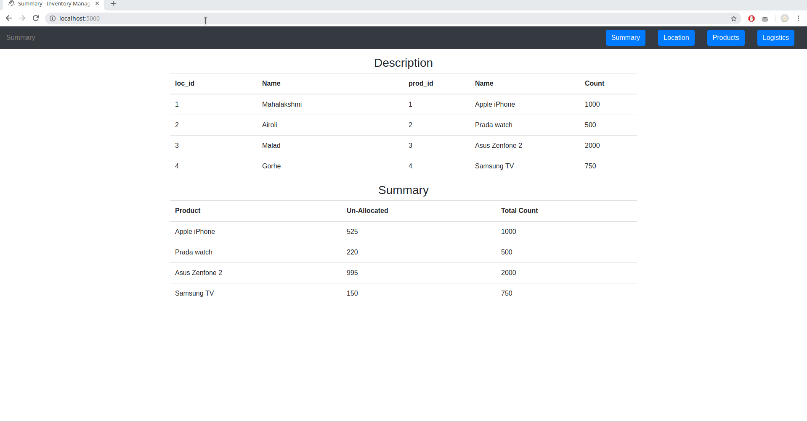

This view of the system can be accessed for demo purposes on installation, to start afresh and remove the inventory.sqlite file from the parent folder

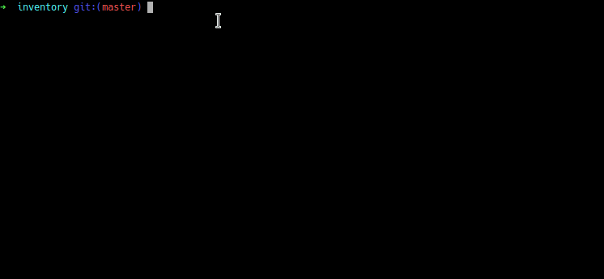

### Getting Into It

A new system will look like this

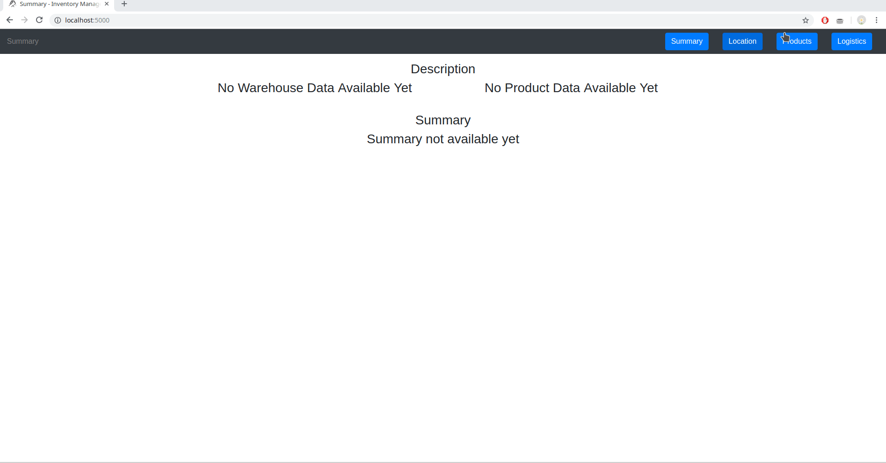

#### Adding Products and Locations

To add products, only the name and quantity are required
Adding locations needs only the name to be added

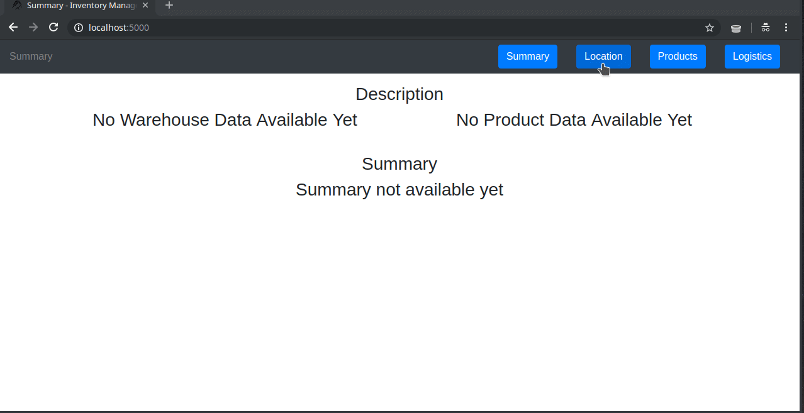

#### Moving Things Around

Products can be moved into and between warehouses _only after_ they have been added to the system

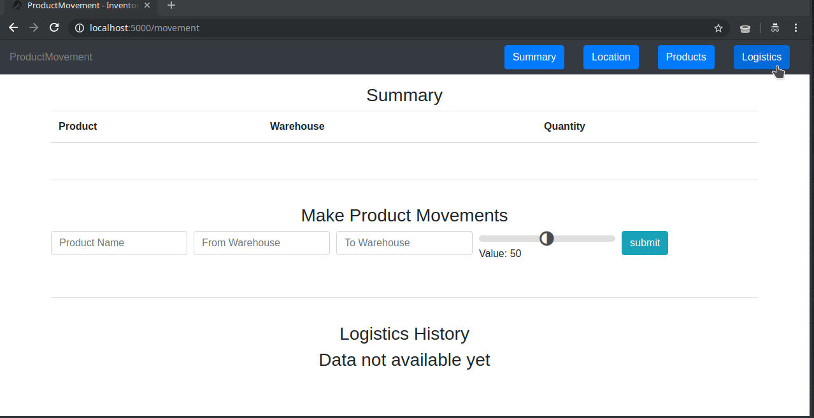

Moving into locations

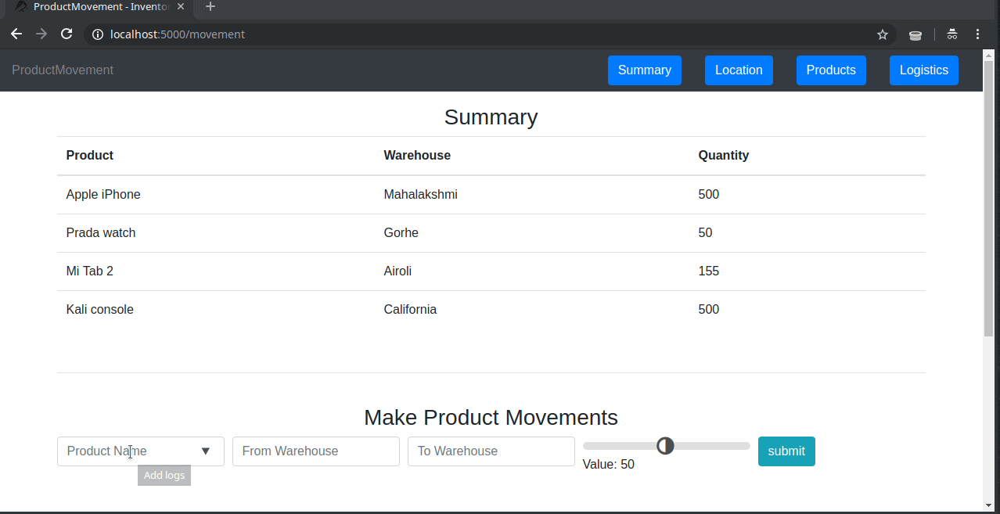

Moving between locations

#### Editing Existing Information

Editing Product Information

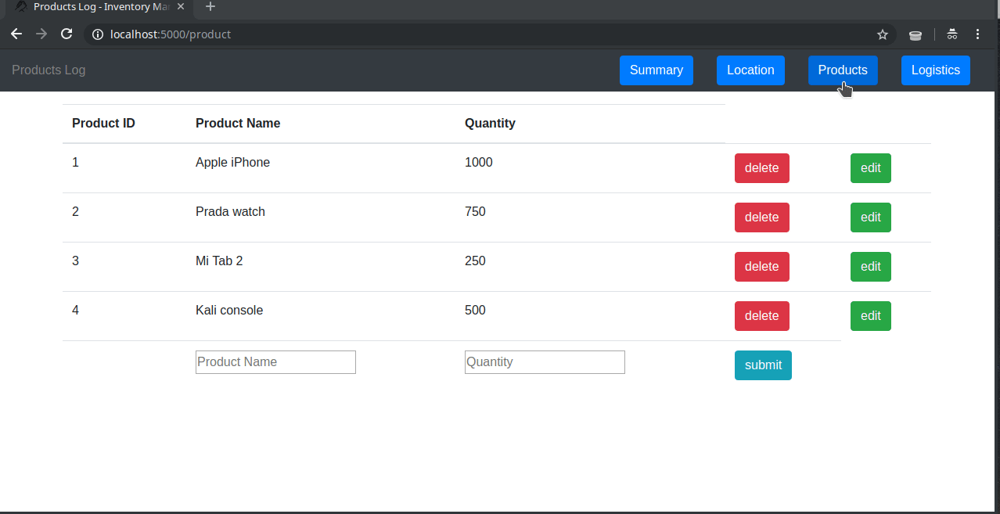

Editing Location Information

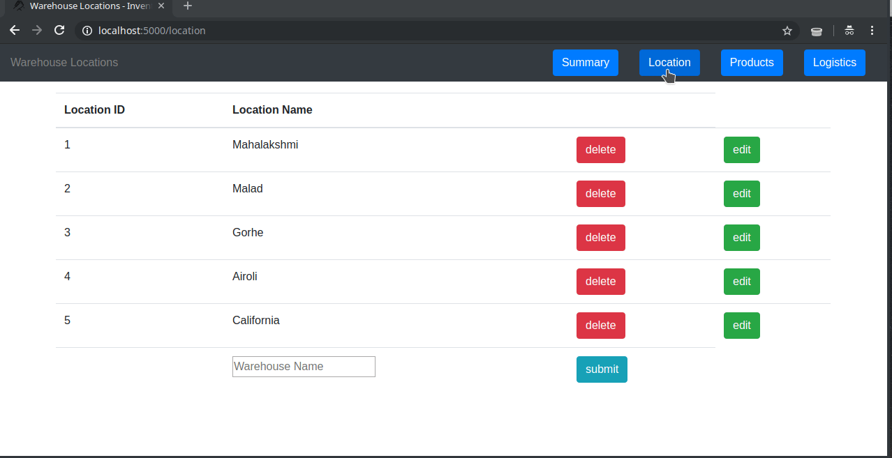

Deleting Products and Locations on the System

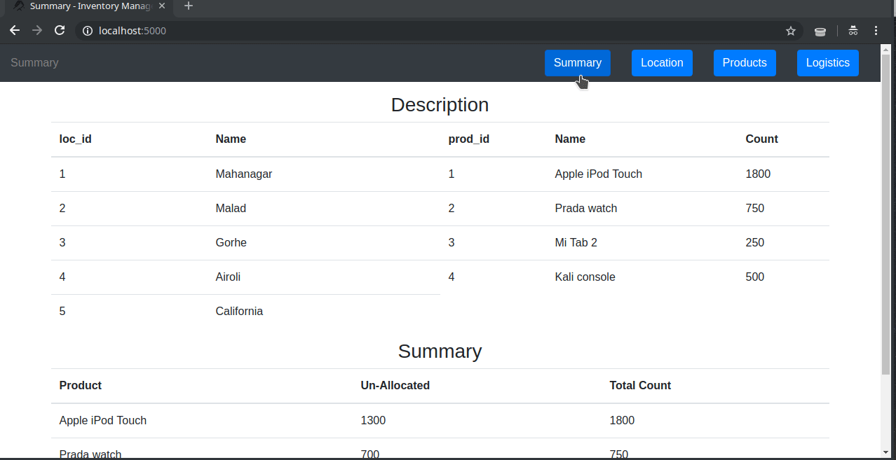

## Dependencies

- Just Flask\!

## License

This project has been published under the [MIT License](LICENSE).
